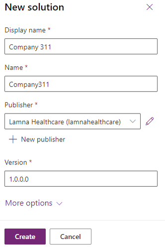
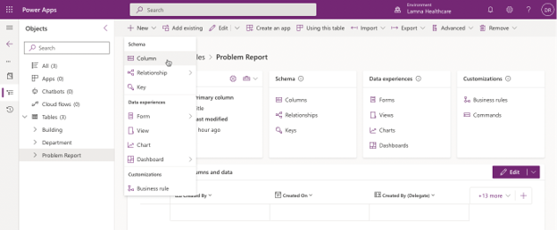
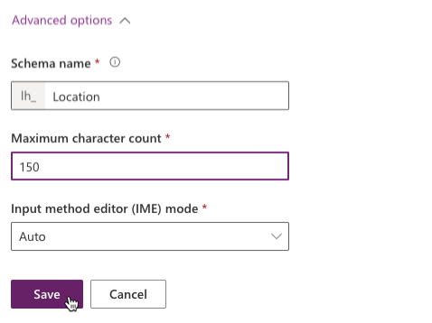
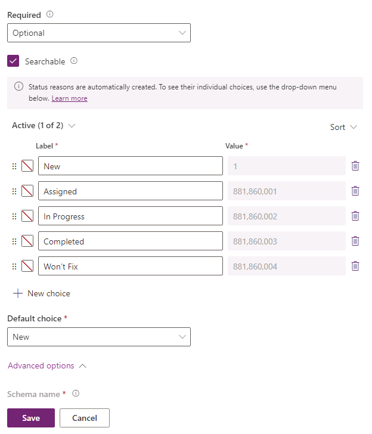
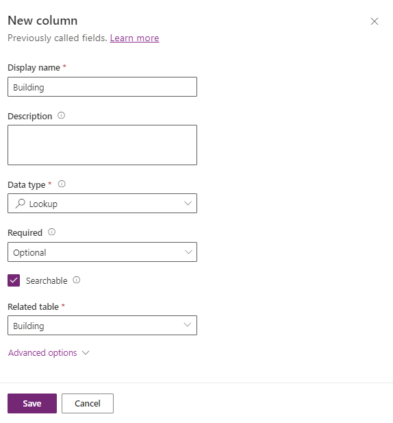

---
lab:
    title: 'Lab 02.1: Data modeling'
    module: 'Module 02: Get started using Dataverse'
---

# Lab 02.1: Data modeling

In this lab you will be implementing the data model for the solution.

## What you will learn

-   Create Tables, Columns, and Lookups

## High-level lab steps

  - Exercise 1 – Create publisher and solution  

  - Exercise 2 – Implement the data model 
    
      - Data Model 
        
          - Building 
          
          - Department 
          
          - Problem Report 

## Detailed steps

### Exercise 1: Create publisher and solution

In this exercise, you will create a custom solution publisher and a solution. This solution will be used in all the labs for this course to keep all the components together. 

#### Task 1: Create publisher and solution

1.  Navigate to the [Power Apps maker portal](https://make.powerapps.com/) and make sure you are in the Dev One environment. 

2.  From the left navigation pane, select **Solutions** and then select **+ New solution**. 

3.  For **Display name**, enter `Company 311` 

4.  Select **+ New publisher**, under the **Publisher** field. 

5.  Enter `Lamna Healthcare` for **Display name**, `lamnahealthcare` for **Name**, `lh` for **Prefix**, `88186` for **Choice value prefix**, and select **Save**.

6.  Select **Lamna Healthcare (lamnahealthcare)** from the **Publisher** dropdown menu. 

7.  Select **Create**. 

    

### Exercise 2: Implement data model

In this exercise, you will create Tables, Columns, and the Relationships you identified when you designed the data model for the Company 311 app.

#### Task 1: Create Tables

1.  In the [Power Apps maker portal](https://make.powerapps.com/) page, make sure you are in the correct environment. Select **Solutions** and open the **Company 311** solution you created in Exercise 1.

2.  Select **+ New** \> **Table** \> **Table**. 

3.  Enter `Building` for **Display name** and select **Save**.

    

4.  Select **All** from the tree view, in the **Objects** pane to display all solution objects and subcomponents. 

5.  Select **+ New** \> **Table** \> **Table** again.

6.  Enter `Department` for **Display name** and select **Save**.

7.  Select **All** from the tree view, in the **Objects** pane to display all solution objects and subcomponents. 

8.  Select **+ New** \> **Table** \> **Table** one more time.

9.  Enter `Problem Report` for **Display name**.

10.  Select the **Primary column** tab, enter `Title` for **Display name**.

11. Select the **Properties** tab, expand **Advanced options**, then scroll to the **Rows in this table** section. 

12. Check the **Can be added to a queue** checkbox and select **Save**. 

    > **NOTE**
    >
    > Enabling queues for Problem Report table allows rows to be associated with one or more queues to help facilitate routing problem reports to the different departments. Once this option is enabled, it can't be turned off. 

12. Select **All** from the tree view in the **Objects** pane. The tables you created should now be visible in the list view and in the tree navigation. 

    

#### Task 2: Add Columns

In this task, you will add Columns to the Problem Report Table.

1.  Navigate to the [Power Apps maker portal](https://make.powerapps.com/) page and make sure you are in the correct environment.

2.  Select **Solutions** and open the **Company 311** solution you created in exercise 1.

3.  Select the **Problem Report** table.

4.  There are many ways to add a new column to the table. For this lab, select **+ New**, then select **Column** from the Schema group. 

    

5.  Enter `Location` for **Display name**. Select **Text** > **Single line of text** > **Plain text** for **Data type**. 

6. Expand the **Advanced options** section, change **Maximum character count** to `150`, then select **Save**. 

    

7.  Select **+ New \> Column** from the top menu. 

8.  Enter `Details` for **Display name**, select **Text** > **Multiple lines of text** > **Plain Text** for **Data type**, make the Column **Business required**, and select **Save**. 

9.  Select **+ New \> Column** again.

10.  Enter `Photo` for **Display name**, select **File** > **Image** for **Data type**, and select **Save**.

11.  Select **+ New \> Column**.

12.  Enter `Resolution` for **Display name**, select **Text** > **Multiple lines of text** > **Plain Text** for **Data type**, and select **Save**.

13.  Select **+ New** \> **Column**.

14.  Enter `Resolved On` for **Display name**, select **Date and time** for **Data type**, and select **Save**. 

15.  Select **+ New** \> **Column**.

16.  Enter `Estimated Cost` for **Display name**, select **Currency** for **Data type**, and select **Save**. 

17.  Select **All** from the tree view in the **Objects** pane. 

18.  Select **Publish all customizations** from the command bar and wait for the publishing to complete.

> **IMPORTANT**
>
> Do not navigate away from this page until all customizations have been published successfully.

#### Task 3: Edit Status Reason Choice

In this task, you will edit the Status Reason column of the Problem Report table.

1.  Make sure you are in the **Company 311** solution.

2.  In the **Objects** navigation tree expand **Tables**, expand **Problem
    Report**, select **Columns**. Locate and select the **Status Reason**
    column.

3.  Change the existing label for the **Active** option to `New`

4.  Select **+ New choice** and enter `Assigned` for **Label**.

5.  Select **+ New choice** and enter `In Progress` for **Label**.

6.  Select **+ New choice** and enter `Completed` for **Label**.

7.  Select **+ New choice** and enter `Won’t Fix` for **Label**.

8.  You should now have 5 options. Verify the **Default choice** is set as
    **New** and select **Save**.

    

9.  Select **All** from the tree view in the **Objects** pane. 

10. Select **Publish all customizations** and wait for the publishing to complete.

#### Task 4: Lookups

In this task, you will create lookups to create many-to-one relationships between the Problem Report table and the Building and Department tables.

1.  In the **Objects** navigation tree expand **Tables**, select and expand the
    **Problem Report** table.

2.	Select **+ New** > **Column**.

3.	Enter `Department` for **Display name**, select **Lookup** for **Data type**,
    set the **Related Table** to `Department` and select **Save**.

4.	Select **+ New** > **Column** again.

5.	Enter `Assign to` for **Display name**, select **Lookup** for Data type, 
    set the **Related table** to `User`, and select **Save**.

6.  Select **+ New** > **Column** again.

7.  Enter `Building` for **Display name**, select **Lookup** for **Data type**,
    set the **Related table** to `Building` and select **Save**.

    

8.	Select **All** from the tree view in the **Objects** pane.

9.	Select **Publish all customizations** and wait for the publishing to complete.

