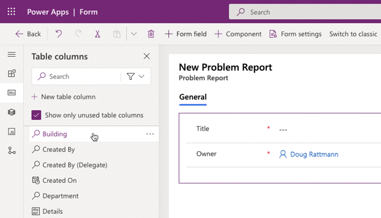
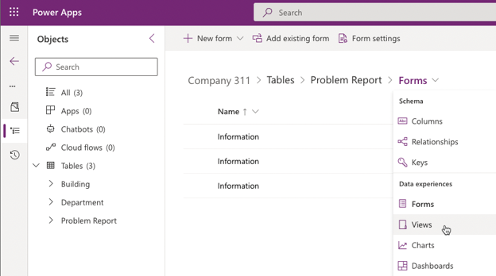

---
lab:
    title: 'Lab 02.2: Work with forms & views'
    module: 'Module 02: Get started using Dataverse'
---

# Lab 02.2: Work with forms & views

In this lab you will be designing the forms and views that will be used in your
model-driven application.

## What you will learn

-   Create and configure Table forms

-   Create and configure Table views

## High-level lab steps

-   Exercise – Configure forms and views

### Exercise 1: Configure form and views

In this exercise, you will configure form and views for the Problem Report table.

#### Task 1: Configure form

1.  Navigate to the [Power Apps maker portal](https://make.powerapps.com/) and make sure you are in the correct environment.

2.  Select **Solutions** and select the **Company 311** solution.

3.  In the **Objects** navigation tree expand **Tables**, expand **Problem Report** table.

4.  Select the **Forms** tab and open the **Information** form of type **Main**.

5.  Use the Zoom control at the bottom of the form to make the form large enough for you to work easily. Select the **General** tab. 

6.  Go to the **Properties** pane, change the **Label** to `Problem details` and enter `tab_problem_details` for **Name**.

7.  While you still have the section selected, go to the **Table columns** pane, and select the **Building** Column. The Building Column will be added to the form.

     

8.  Add the **Details**, and **Photo** Columns to the form.

9.  Your form should now look like the image below. Select the **Details** Column.

     

10. Go to the **Properties** pane and expand the **Formatting** section.

11. Change the **Form field height** to **4 rows**.

12. Select **Components** from the left navigation menu then select **1-column section**.

13. A new section should be added to the form. Select the **New Section**.

14. Go to the **Properties** pane, change the **Section label** to `Resolution details` and enter `section_resolution_details` for **Name**.

    

15. Select **Table columns** from the toolbar.

16.  Add **Department**, **Status Reason**, **Resolved On**, **Assigned to**,
    **Estimated Cost**, and **Resolution** columns to the **Resolution details**
    section.

17. Select the **Resolution** column.

18. Go to the **Properties** pane and, if necessary, expand the **Formatting** section.

19. Change the **Form field height** to **4 rows**.

20. Select **Save and publish**.

21. Wait for the publishing to complete.

22. Select the **🡠 Back** button to return to the **Solution Explorer**.

#### Task 2: Edit view

1.  In the **Problem Report** table, under **Data experiences**, select **Views**.

    

2.  Open the **Active Problem Reports** view.

3.  Select **Building** in the **Table columns** list to add the **Building** column to the view.

4.  Select **Location**, **Status Reason**, and **Owner** columns to add them to the view.

5.  Go to the view **Properties** pane and select **Edit filters**.

6.  Change the existing filter and set it to **Status Reason Equals New**.

7.  Expand the values drop-down with Status Reason values where **New** is selected.

8.  Select **Assigned**.

9.  Select the drop-down again and select **In Progress**.

10. The filter should now look like the image below. Select **Ok**.

    

11. Select **Save and publish**.

#### Task 3: Create view from existing

In this task, you will create a new view from the Active Problem Reports view.

1.  Select **Edit filters**.

2.  Remove **In Progress** from the filter.

3.  Remove **Assigned**, then remove **New** value from the filter.

4.  Select the drop-down list, then select **Completed**.

5.  Add **Won’t Fix** and **Inactive** values to filter.

6.  The filter should now look like the image below. Select **Ok**.

    

7.  Select **Save As**.

8.  Enter `Resolved Problems` for **Name** and select **Save**.

9.  Select the **🡠 Back** button to return to the solution explorer.

10. Select **All** in the **Objects** navigation tree.

11. Select **Publish all customizations** and wait for the publishing to complete.

