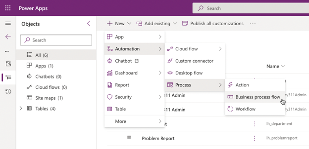
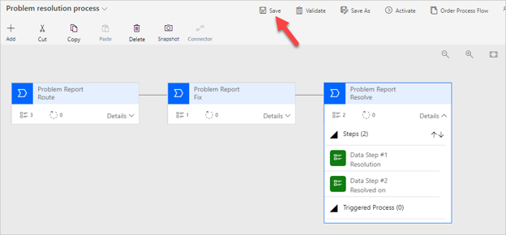

---
lab:
    title: 'Lab 02.5: Business process flows and business rules'
    module: 'Module 02: Building model-driven apps'
---

# Lab 02.2: Business Process Flows and Business Rules

In this lab you will enhance the data model and improve the app behavior by adding a business process flow and a business rule.

## What you will learn

  - How to identify stages in a Business Process Flow (BPF)

  - How to create and use a BPF

  - How to use a business rule to implement logic

## High-level lab steps

  - Exercise 1 – Create BPF lifecycle of problem report
    
      - Route 
      
      - Fix 
      
      - Resolved 

  - Exercise 2 – Business rule to not allow close without resolution

## Prerequisites

Must have completed the following labs:

-   02.1: Data model

-   02.2: Work with forms and views

-   02.3: Compose a model-driven app

-   02.4: Import data

## Detailed steps

### Exercise 1: Create business process flow

In this exercise, you will create a business process flow for the problem report table.

#### Task 1: Create business process flow

In this task, you will create a business process flow for the Problem Report table.

1.  Navigate to the [Power Apps maker portal](https://make.powerapps.com/) page and make sure you are in the correct environment.

2.  Select **Solutions** and open the **Company 311** solution.

3.  Select **+ New > Automation > Process > Business process flow**.

    

4.  In the **New business process flow** panel, enter `Problem resolution process` for **Display name**, select **Problem Report** for **Table**, and select **Create**.

5.  Open the **Problem resolution process** business process flow created in the previous step. Select the **New stage**, go to the **Properties** pane, change the **Display Name** to `Route` and select **Apply**. 

6.  Expand **Details** of the **Route** stage.

7.  Select **Data Step \#1**, go to the **Properties** pane, select **Building** for **Data Field**, and select **Apply**.

8.  Select **+ Add** and select **Add Data Step**.

9.  Select the **+** option to add the data step below the **Building** data step.

10. Select the new data step, go to the **Properties** pane, select **Location** for **Data Field**, and select **Apply**.

11. Select **+ Add** again and select **Add Data Step**.

12. Select the new data step, go to the **Properties** pane, select **Department** for **Data Field**, and select **Apply**.

13. The **Route** stage should now look like the image below.

    

14. Select **+ Add** and select **Add Stage**.

15. Add the new stage after the **Route** stage.

16. Select the stage, go to the **Properties** pane, enter `Fix` for **Display Name**, and select **Apply**.

17. Expand **Details** of the **Fix** stage.

18. Select **Data Step \#1** of the **Fix** stage.

19. Go to the **Properties** pane, select **Assign to** for **Data Field** and select **Apply**.

20. Select **+ Add** and select **Add Stage**.

21. Add the new stage after the **Fix** stage.

22. Select the new stage, go to the **Properties** pane, enter `Resolve` for **Display Name** and select **Apply**.

23. Expand **Details** of the **Resolve** stage.

24. Select **Data Step \#1** of the **Resolve** stage.

25. Go to the **Properties** pane, select **Resolution** for **Data Field** and select **Apply**.

26. Select **+ Add** and select **Add Data Step**.

27. Add the new data step below the **Resolution** data step.

28. Select the new data step, go to the **Properties** pane, select **Resolved On** for **Data Field** and select **Apply**.

29. The Business process flow should now look like the image below. Select **Save**.

    

30. Select **Activate**.

31. To confirm, select **Activate** on the pop-up.

32. Confirm that 'Status: **Active**' shows at the bottom left of the Business Process Flow canvas.

33. Close the process editor browser tab.

34. Select **Done**.

### Exercise 2: Create business rule

In this exercise, you will create a business rule that will block completion of problems without resolution.

#### Task 1: Create business rule

1.  Navigate to the [Power Apps maker portal](https://make.powerapps.com/) page and make sure you are in the correct environment.

2.  Select **Solutions** and open the **Company 311** solution.

3.  Locate and open the **Problem Report** Table.

4.  Select **+ New** and under **Customizations**, select **Business rule**.

5.  Make sure the **Scope** is set to **Entity** in the selector in the right corner of the screen. 

6.  Select the **Show details** chevron located next to New business rule title on the same row as the scope.

    

7.  Change **Business rule name** to `Completion rule` and select the **Hide details** chevron.

    
 
8.  Select the **Condition**.

9.  Go to the **Properties** pane and change the **Display Name** to `Resolution required`

10.  Scroll down the **Rules** section, select **Status Reason** for **Field**, select **Equals** for **Operator**, select **Value** for **Type**, select **Completed** for **Value**, and select **Apply**.

    

11. Select **+ New**.

    

12. Scroll down to **Rule 2**, select **Resolution** for **Field**, select **Does not contain data** for **Operator**, make sure **AND** is selected for **Rule Logic**, and select **Apply**.

    

13. Select **+ Add**.

14. Select **Add Show Error Message**.

15. Add the action on the **true** path of the condition, indicated by the tick.

16. Select the new action, go to the **Properties** pane, enter **Show message** for **Display Name**, select **Status Reason** for **Field**, enter `The Problem must have a resolution before it can be closed.` for **Message**, and select **Apply**.

17. The business rule should now look like the image below. Select **Save**.

     

18. Select **Activate**.

19. To confirm, select **Activate** on the pop-up.

20. Confirm activation. The **Activate** button will change to **Deactivate** and it will show **Activated** in the bottom left of the Business Rule canvas.

21. Close the process editor browser window or tab.

22. Select **Done**.

23.	Select + New and under Customizations, select Business rule.

24.	Make sure the Scope is set to Entity in the selector in the right corner of the screen.

25.	Select the Show details chevron located next to New business rule title on the same row as the scope.

26.	Change Business rule name to Resolved on rule and select the Hide details chevron.

27.	Select the Condition.

28.	Go to the Properties pane and change the Display Name to Resolved on Required

29.	Scroll down the Rules section, select Resolution for Field, select Contains Data for Operator, and select Apply.

30.	Select + Add.

31.	Select Add Set Business Required.

32.	Add the action on the true path of the condition, indicated by the tick.

33.	Select the new action, go to the Properties pane, enter Make Required for Display Name, select Resolved On for Field, Select Business Required, and select Apply.

34.	Select + Add.

35.	Select Add Set Business Required.

36.	Add the action on the false path of the condition, indicated by the tick.

37.	Select the new action, go to the Properties pane, enter Make Not Required for Display Name, select Resolved On for Field, Select Business Required, and select Apply.

38.	The business rule should now look like the image below. Select **Save**.

     

39.  Select **Activate**.

40.  To confirm, select **Activate** on the pop-up.

41.  Confirm activation. The **Activate** button will change to **Deactivate**
    and it will show **Activated** in the bottom left of the Business Rule
    canvas.

42.  Close the process editor browser window or tab.

43.  Select **Done**.

44.  Select **All** in the **Objects** navigation tree.

45.  Select **Publish all customizations** and wait for the publishing to
    complete.

### Exercise 3: Test processes

In this exercise, you will test the business process flow and the business rules you created.

#### Task 1: Test processes

1.  Navigate to the [Power Apps maker portal](https://make.powerapps.com/) page and make sure you are in the correct environment.

2.  Select **Apps** and run the **Company 311 Admin** application.

    

3.  Select **Problem Reports** and select **+ New**.

4.  You should see the business process flow stages. Enter `Dark parking lot` for **Title**, select **London Paddington** for **Building**, enter `There are no lights at the north end of the parking lot` for **Details**, and select **Save**.

5.  Select the **Route** stage.

6.  Enter `North-end` for **Location**, select **Maintenance** for **Department** and select the **Next Stage** button.

    > **NOTE**
    >
    > If the **Next Stage** button is not visible, then refresh the page.

7.  Select a user for **Assign to** and select **Next Stage**.

8.  Select an appropriate date and time for the **Resolved on** and leave the **Resolution** value empty.

9.  Scroll down to the **Resolution details** section and select **Completed** for **Status Reason**. You should see the business rule error message defined earlier.

10. Enter `Installed lights on the North-end of the parking lot` for **Resolution**. The error message should go away.

11. Select **Save** to save the Problem Report.

