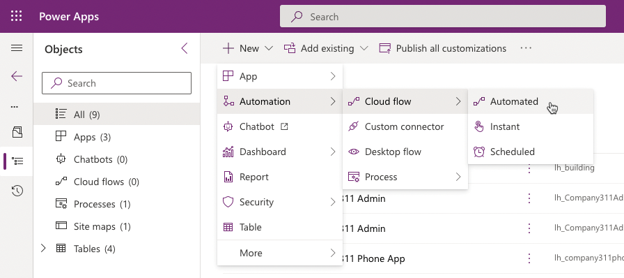
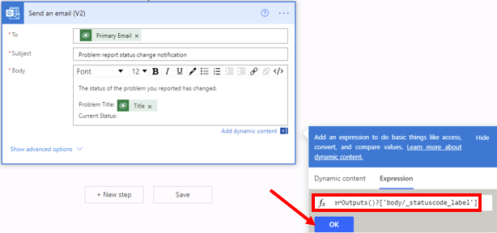
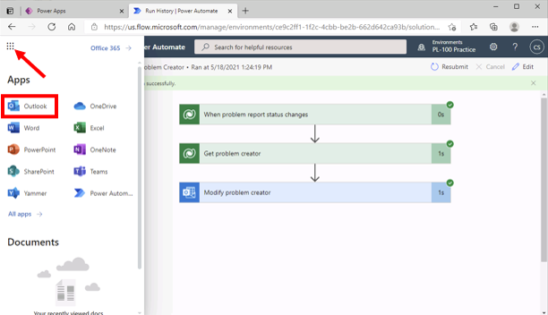
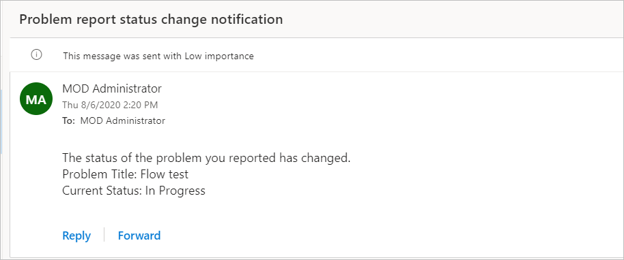
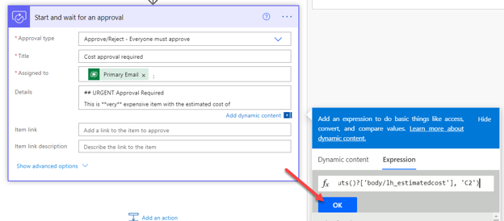
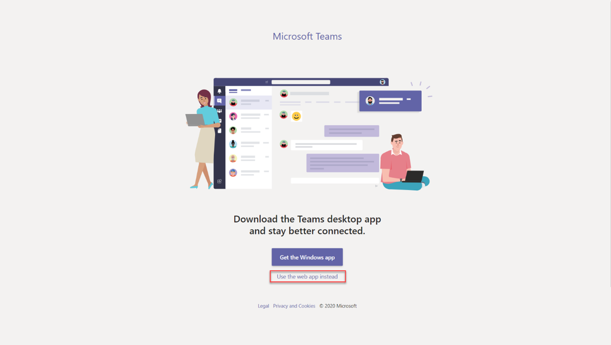
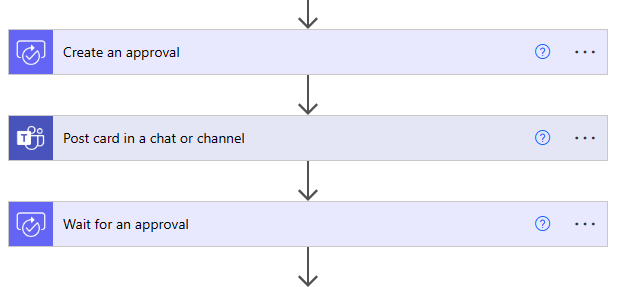

---
lab:
    title: 'Lab 06.1: Create Power Automate flows'
    module: 'Module 06: Automate a business process using Power Automate'
---

# Lab 06.1: Create Power Automate flows

In this lab, you will create Power Automate cloud flows to automate various parts of the Company 311 solution.

The following have been identified as requirements you must implement to complete the project: 

  - Escalation, approval, and execution process for urgent maintenance issues 

  - Notify reporting user about the issue status changes 

## What you will learn

  - How to design data columns (in the data model) to support automation 

  - How to build a flow using Microsoft Dataverse Connector

  - How to use approvals 

## High-level lab steps

  - Add columns to support escalation 
  - Build flow to approve escalation  
  - Build flow to notify user of status change
  - Build approval as an adaptive card in Microsoft Teams 

## Prerequisites

Must have completed the following labs:

-   02.1: Data model

-   02.2: Work with forms and views

-   02.3: Compose a model-driven app

-   02.4: Import data

-   02.5: Business process flows and business rules

## Things to consider before you begin

  - What is the most efficient way to identify urgent maintenance issues and escalate them?

## Detailed steps  

### Exercise 1: Build notification flow

In this exercise, you create a flow that will notify the creator of a problem when the status changes.

#### Task 1: Create flow

In this task, you will create a flow that send a notification when the status of problem report row changes.

1.  Navigate to the [Power Apps maker portal](https://make.powerapps.com/) and make sure you are in the correct environment.

2.  Select **Solutions** and open the **Company 311** solution.

3.  Select **+ New** > **Automation** > **Cloud Flow** > **Automated**.

    

4.  Search for and select the **When a row is added, modified or deleted** action from the **Microsoft Dataverse** connector. 

5.  Select **Create**.

6.  Select **Modified** for **Change type**, select **Problem Reports** for **Table name**, **Organization** for **Scope** and expand **Show advanced options**.

7.  Enter `statuscode` for **Select columns** then select **… Menu** button of the trigger step.

    

8.  Select **Rename**.

9.  Rename the trigger step `When problem report status changes`

10.  Select **+ New step**.

11. On the **All** tab, select **Microsoft Dataverse** then select the **Get a row by ID** action. 

12. Select **Users** for **Table name**.

13. Select the **Row ID** field, go to the **Dynamic content** pane, search for `created` and select **Created By (Value)**.

14. Select **Show advanced options** on the new step.

15. Enter `internalemailaddress` for **Select columns**.

16. Select the **… Menu** button of the new step and select **Rename**.

17. Rename the step `Get problem creator`

18. Select **+ New step**.

19. Search for `send email` and select the **Send an email (V2)** action from the **Office 365 Outlook** connector.

20. Select the **To** field and select the **Switch to Advanced Mode** arrows icon. Selecting this button toggles show/hide of the Dynamic content pane.

     

21. Select the **Primary Email** field from the **Get problem creator** step.

22. Enter `Problem report status change notification` for **Subject**.

23. Select the **Body** field.

24. Enter `The status of the problem you reported has changed.` and press the **[ENTER]** key.

25. Enter `Problem Title: `, go to the **Dynamic content** pane, search for `title` and select **Title**.

26. Press the **[ENTER]** key.

27. Enter `Current Status: `, go to the **Dynamic content** pane, select the **Expression** tab, paste the expression below, and select **OK**. This expression will show the label of the Status Reason instead of the value.

    `triggerOutputs()?['body/_statuscode_label']`

    

28. Select the **… Menu** button of the new step and select **Rename**.

29. Rename the step to `Notify problem creator`

30. The step should now look like the image below.

    

31. At the top of the page, change the flow name from **Untitled** to `Notify Problem Creator`

32. Select **Save** and wait for the flow to be saved.

    

33. Select the **🡠** button to go back to the previous page.

#### Task 2: Test the flow

In this task, you will test the Notify Problem Creator flow.

1.  On the Power Apps maker portal, `https://make.powerapps.com` ensure you are in the correct environment.

2.  Select **Apps**, and then select the **Company 311 Admin** Model-driven application. Select **Play**.

3.  Select **+ New**.

4.  Enter `Flow test` for **Title**, select **London Paddington** for **Building**, enter `This is a flow test` for **Details**, and select **Save**.

5.  Scroll down and change the **Status Reason** value to **In Progress** and save again.

6.  Close the application browser window or tab.

7.  You should now be back to the [Power Apps maker portal](https://make.powerapps.com/)

8.  Select **Solutions** and open the **Company 311** solution.

9.  Locate and open the **Notify Problem Creator** Cloud Flow Details in a new tab.

10. You should see a succeeded flow run in the **28-day run history** section. Open the run.

    

11. All the flow steps should have a **green** check mark.

12. Select the **App launcher** and under **Apps**, select **Outlook**.

    

13. You should have received an email from the cloud flow. **Open** the email.

14. The email should resemble the image below.

    

### Exercise 2: Build escalation flow

In this exercise, you will create an escalation flow.

#### Task 2: Build escalation flow

In this task, you will create the escalation flow.

1.  Navigate to the [Power Apps maker portal](https://make.powerapps.com/) and make sure you are in the correct environment.

2.  Select **Solutions** and open the **Company 311** solution.

3.  Select **+ New > Automation > Cloud Flow > Automated**.

4.  Search for `when a row is added` and select **When a row is added, modified, or deleted** from the **Microsoft Dataverse** connector, then select **Create**.

5.  Select **Added or Modified** for **Change type**, select **Problem Reports** for **Table name**, select **Organization** for **Scope** and select **Show advanced options**.

6.  Enter **lh_estimatedcost,lh_assignto** for **Select columns**.

7.  Select the **… Menu** button of the trigger step and select **Rename**.

8.  Rename the trigger step **When a problem report is created or updated**.

9.  Select **+ New step**.

10. Search for `Condition` and select the **Condition** action from the **Control** connector.

11. Select the first **Choose a value** field.

12. Go to the **Dynamic content** pane, search for and select **Estimated Cost**. 

13. Select **is greater than** in the second field and enter `1000` in the third field.

14. Rename the condition step to `Check if cost is greater than 1000`

15. Go to the **If yes** branch and select **Add an action**.

16. Search for `Get a row` and select the **Get a row by ID** action from the **Microsoft Dataverse** connector. 

17. Select **Users** for **Table name**.

18. Select the **Row ID** field and select **Assign to (Value)** from the **Dynamic content** pane.

19. Select **Show advanced options**.

20. Enter `internalemailaddress` for **Select columns**.

21. Rename the **Get a Row by ID** step `Get user`.

22. Select **Add an action**.

23. Search for `approval` and select the **Start and wait for an approval** action from the **Approvals** connector. 

24. Select **Approve/Reject - Everyone must approve** for **Approval type**.

25. Enter `Cost approval required` for **Title**.

26. Select the **Assigned to** field.

27. Go to the **Dynamic content** pane and select **Primary Email** from the **Get user** step.

28. Enter the markdown text below in the **Details** field.

    `\#\# URGENT Approval Required
    
    This is \*\*very\*\* expensive item with the estimated cost of `

29. Place your cursor after cost of, go to the **Dynamic content** pane, select the **Expression** tab, paste the expression below, and select **OK**.

    `formatNumber(triggerOutputs()?['body/lh_estimatedcost'], 'C2')`

    

30. Select **Add an action**.

31. Search for and select the **Condition** action from the **Control** connector.

32. Select the first **Choose a value** field.

33. Go to the **Dynamic content** pane, search for and select **Outcome**. 

34. Enter **Reject** for value in the third field.

35. Go to the **If yes** branch and select **Add an action**.

36. Search for and select the **Update a row** action from the **Microsoft Dataverse** connector. 

37. Select **Problem Reports** for **Table name**.

38. Select the **Row ID** field.

39. Go to the **Dynamic content** pane, search for `problem report` and select **Problem Report**.

40. Select **Show advanced options**.

41. Select the **Resolution** field, go to the **Dynamic content** pane and select **Response summary**.

42. Select **Won’t fix** for **Status Reason**.

43. Rename the step `Update problem report`

44. Scroll up and rename the flow `Escalate Expense Approval`

45. Select **Save**.

46. Close the flow designer browser window or tab.

47. Select **Done** on the popup.

#### Task 3: Test flow

In this task, you will test the escalation flow.

1.  Navigate to the [Power Apps maker portal](https://make.powerapps.com/) and make sure you are in the correct environment.

2.  Select **Apps**, and then select the **Company 311 Admin** Model-driven application. Select **Play**.

3.  Open one of the **Problem Report** rows.

4.  Scroll down, enter `2500` for **Estimated Cost**, assign it to **yourself** (for test purposes) and select **Save**.

5.  Navigate to the Power Automate maker portal: `https://make.powerautomate.com/`

6.  Select **Approvals**.

7.  You should see at least one approval in the received tab. Open the approval. 

    **Note:** It can take around 10-15 minutes for approvals to show up here on the first run as the Approvals app must provision itself in your environment.

8.  Choose the **Reject** response, enter `We don't have the funds for this item` for **Add a comment**, and select **Confirm**. 

9.  Go back to the **Company 311 Admin** Model-driven application.

10. Change the view to **My Reports** and open the test row on which the **Estimated Cost** was changed. 

11. The **Status Reason** should be set to **Won’t fix** and the **Resolution** should contain the details of Approver, Response, Request Date and Response Date.

### Exercise 3: Send approval requests as adaptive card in Microsoft Teams

In this exercise, you will setup a team in Microsoft Teams dedicated to the Company 311 applications. You will modify the flow to send the approval request as an adaptive card in Teams chat instead of an approval message.

* Task 1: Setup Company 311 Team
* Task 2: Modify flow to send adaptive card in Teams chat
* Task 3: Test adaptive card

#### Task 1: Setup Company 311 Team

In this task you will setup a Microsoft Teams team for the Lamna Healthcare Company, if you have not done so in previous exercises.

1.  Navigate to [Microsoft Teams](https://teams.microsoft.com) and sign in with the same credentials you have been using previously.

2.  Select **Use the web app instead** on the welcome screen.

    

3.  When the Microsoft Teams window opens, dismiss the welcome messages.

4.  On the bottom left corner, choose **Join or create a team**.

5.  Select **Create a team**.

6.  Press **From scratch**.

7.  Select **Public**.

8.  For the Team name choose **Company 311** and select **Create**.

9.  Select **Skip** adding members to Company 311.

#### Task 2: Modify flow to send adaptive card in Teams chat

In this task you will replace the approval sent by email with an adaptive card. 

1.  Navigate to the [Power Automate maker portal](https://make.powerautomate.com/) and make sure you are in the correct environment.

2.  Select **Solutions** and open the **Company 311** solution.

3.  Select **Cloud flows** from the **Objects** pane and open the **Escalate Expense Approval** flow. Select **Edit**. 

4.  Locate **Start and wait for an approval** step created earlier in **Exercise 2**. 

5.  Select the **...** menu, and then select **Delete**. 

6.  Hover your mouse between the steps, select the **+** to insert a new step then select **Add an action**. 

7.  Search for and select **Create an approval**. 

8.  Select **Approve/Reject - Everyone must approve** for **Approval type**. 

9.  Enter **Cost approval required** for **Title**. 

10. Select the **Assigned to** field. 

11. Go to the **Dynamic content** pane and select **Primary Email** from the **Get user** step. 

12. Paste the markdown text below in the **Details** field. 

    > \*\*{title}\*\*
    >
    > {details}
    >
    > This is a \_very\_ expensive item with the estimated cost of 

13. Select **{title}** placeholder, go to the **Dynamic content** pane, locate and select **Title** field from **When a problem report is created or updated** step.

14. Select **{details}** placeholder, go to the **Dynamic content** pane, locate and select **Details** field from **When a problem report is created or updated** step.

15. Place the cursor after **cost of**, go to the **Dynamic content** pane, select the **Expression** tab, paste the expression below, and select **OK**.

16. Your step should look like the following: 

     

17. Hover your mouse again below **Create an approval** step, select **+** and then select **Add an action**.

18. Search for `teams` and select **Post card in a chat or channel** action. 

19. Select **Flow bot** for Post as and select **Chat with Flow bot** for Post in. 

20. Select the **Recipient** field. 

21. Go to the **Dynamic content** pane and select **Primary Email** from the **Get user** step. 

22. Select **Message** field. 

23. Go to the **Dynamic content** pane and select **Teams Adaptive Card** from the **Create an approval** step.

24. The **Post card in a chat or channel** step should look like the image below:

    

25. Hover the cursor below the **Post card in a chat or channel** step, select **+** and then select **Add an action**.

26. Search for `approval` and select **Wait for an approval** action.

27. Select **Approval ID** field.

28. Go to the **Dynamic content** pane and select **Approval ID** from the **Create an approval** step.

29. You now have replaced **Start and wait for an approval** step with the following:

    

30. Expand the **Condition** step. The left value of the **Condition** step should be empty because it was referring to the old step which is now removed. 

31. Go to the **Dynamic content** pane, search for  and select **Outcome** from **Wait for an approval** step. 

32. Locate the **Update problem report** step, under the **If yes** branch. 

33. Select **Show advanced options**.

34. Select the **Resolution** field, go to the **Dynamic content** pane, and select **Response summary** from **Wait for an approval** step.

35. Select **Save**.

36. **Close** the flow designer browser window or tab.

37. Select **Done** on the pop-up.

#### Task 3: Test flow

In this task, you will test the escalation flow with the Teams and adaptive cards.

1.  Navigate to the [Power Apps maker portal](https://make.powerapps.com/) and make sure you are in the correct environment.

2.  Select **Apps**, and then select the **Company 311 Admin** Model-driven application. Select **Play**.

3.  Open one of the **Problem Report** Rows.

4.  Scroll down, enter any amount greater than **1000** for **Estimated Cost**, assign it to **yourself** (for test purposes) and select **Save**.

5.  Navigate to [Microsoft Teams](https://teams.microsoft.com).

6.  Select **Chat**.

7. You should see the **Cost approval required** adaptive card in a message from **Workflows**.

8. Select the **Reject** button and enter a comment of your choice in the **Comments** area, for example **The item is too expensive**.

9. Select **Submit**. The card will become read-only.

10. Go back to the **Company 311 Admin** application.

11. Change the view to **My Reports** and open the same row you changed the estimated cost for.

12. The **Status Reason** should be set to **Won’t fix** and the **Resolution** should contain the details of Approver, Response, Request Date and Response Date.
